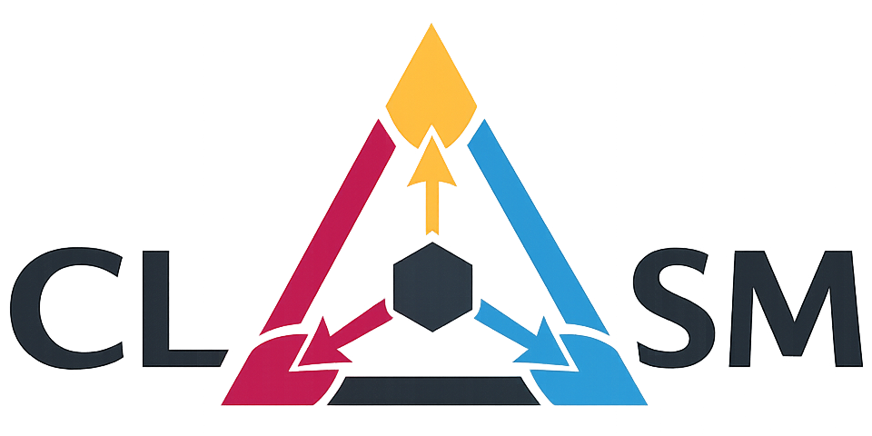

# CLSM

**Constrained Latent State Modeling (CLSM)** (pronounced *"clasm"*) is a
framework for analyzing and designing latent representations under multiple
interacting constraints.

CLSM views latent representations as latent states shaped by several
complementary design principles rather than by a single objective. The framework
provides a common language for describing representation-learning methods,
their assumptions, and the empirical trade-offs induced by their objectives and
optimization procedures.

<p align="center">
  
</p>

---

## Core constraints

CLSM characterizes latent state representations through six complementary
constraint families:

| Constraint | Description |
|---|---|
| 🎯 Predictive sufficiency | Preserve information necessary for prediction |
| ✂️ Minimality | Encourage compact and parsimonious representations |
| ⏱️ Temporal coherence | Encourage dynamically consistent latent trajectories |
| 👁️ Observation compatibility | Maintain consistency with observed data |
| 🛡️ Invariance to nuisance factors | Reduce sensitivity to irrelevant variability |
| 🧩 Structural constraints | Encourage useful geometric or statistical structure |

These constraints may interact and produce empirical trade-offs depending on
the chosen objectives, parameterization, and optimization procedure.

---

## Repository contents

This repository provides:

- the conceptual CLSM perspective;
- lightweight model cards describing representative methods through the CLSM lens;
- a lightweight PyTorch reference implementation;
- a synthetic environment illustrating the six constraint families;
- reproducible training and evaluation pipelines;
- post-hoc probes and representation-level diagnostics;
- Pareto analysis of competing representation properties;
- publication-oriented visualization utilities.

---

## Reference implementation

The implementation separates representation learning from post-hoc evaluation.

Training combines selected CLSM constraint surrogates. When nuisance invariance
is active, a separately optimized categorical nuisance adversary is alternated
with encoder updates. After the initial joint-training phase, an optional
adversarial refresh phase uses fixed latent normalization.

Evaluation is performed on frozen representations using independent probes and
direct representation-level diagnostics. The main evaluation axes include:

- multi-step observation prediction;
- physical-state accessibility;
- neighborhood preservation;
- counterfactual consistency;
- nuisance accessibility.

A lightweight `pareto` probe profile is used for large sweeps, while a `full`
profile provides additional nonlinear, temporal, CCA, and nuisance diagnostics.

---

## Installation

```bash
git clone https://github.com/gwenole-quellec/clsm.git
cd clsm

python -m venv .venv
source .venv/bin/activate

pip install -r requirements.txt
```

---

## Generate the toy dataset

```bash
python -m toy.environment \
  --metadata toy/metadata.json \
  --output-dir data
```

---

## Run selected configurations

```bash
python -m scripts.run_presets \
  --train-module toy.train \
  --metadata toy/metadata.json \
  --data-dir data
```

Training outputs are written to `runs/`.

---

## Run the constraint sweep

A reproducible six-weight sweep can be run with:

```bash
python -m scripts.constraint_sweep \
  --train-module toy.train \
  --data-dir data \
  --num-configurations 200 \
  --sweep-seed 12345 \
  --model-seeds 0 1 2 3 4 \
  --adversary-steps 15 \
  --epochs 50 \
  --refresh-pretrain-epochs 40 \
  --probe-profile pareto \
  --nuisance-probe-epochs 500 \
  --device cuda
```

The sweep evaluates configurations on the validation split and constructs the
selected pairwise Pareto fronts from five representation-level metrics.

---

## Repository structure

- [`clsm/`](clsm/) — generic CLSM framework
- [`toy/`](toy/) — synthetic environment and training entry point
- [`scripts/`](scripts/) — training, evaluation, sweep, and visualization pipelines
- [`model_cards/`](model_cards/) — CLSM descriptions of representative methods
- [`implementation/`](implementation/) — implementation and reproducibility documentation

---

## Paper

If you use CLSM in your research, please cite:

**Constrained latent state modeling: A unifying perspective on representation
learning under competing constraints**

Preprint available on arXiv: [arXiv:2605.15995](https://arxiv.org/abs/2605.15995)

```bibtex
@misc{quellec2026clsm,
  title={Constrained latent state modeling: A unifying perspective on representation learning under competing constraints},
  author={Gwenol\'e Quellec},
  year={2026},
  eprint={2605.15995},
  archivePrefix={arXiv},
  primaryClass={cs.LG},
  url={https://arxiv.org/abs/2605.15995}
}
```

---

## License

This project is released under the MIT License.
