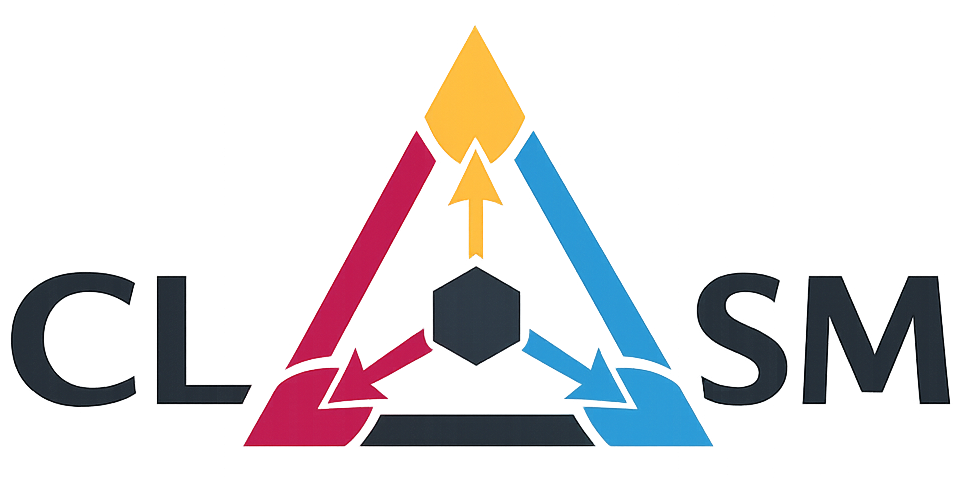

# CLSM Overview

Constrained Latent State Modeling (CLSM) is a framework for analyzing and designing latent representations under competing constraints.

Rather than viewing latent representations solely as compressed embeddings or optimization artifacts, CLSM interprets them as **latent states** governed by multiple interacting design principles. From this perspective, representation learning becomes a problem of balancing complementary constraints rather than optimizing a single objective.

  

---

## Core idea

Many representation learning approaches implicitly prioritize different properties of the latent space:

- predictive models prioritize future-relevant information,
- reconstruction-based models emphasize observation fidelity,
- compressed representations favor minimality,
- structured models enforce interpretability or mechanistic assumptions.

CLSM provides a unified language for describing these choices.

Instead of categorizing methods solely by architecture or training paradigm, CLSM characterizes them according to the constraints they enforce and the trade-offs they implicitly resolve.

---

## Core constraints

CLSM identifies six complementary constraints governing latent state representations.

| Constraint | Description |
|---|---|
| 🎯 Predictive sufficiency | Preserve information necessary for prediction |
| ✂️ Minimality | Encourage compact and parsimonious representations |
| ⏱️ Temporal coherence | Ensure dynamically consistent latent trajectories |
| 👁️ Observation compatibility | Maintain consistency with observed data |
| 🛡️ Invariance to nuisance factors | Improve robustness to irrelevant variability |
| 🧩 Structural constraints | Introduce interpretable or mechanistic structure |

These constraints are generally incompatible when optimized simultaneously, leading to intrinsic trade-offs.

---

## Trade-offs

A central idea of CLSM is that latent representation learning is inherently multi-objective.

Examples of common tensions include:

- 🎯 Predictive sufficiency vs ✂️ Minimality  
  retaining predictive information while compressing representations

- 🛡️ Invariance vs information preservation  
  removing nuisance variability without discarding meaningful signals

- 👁️ Observation compatibility vs abstraction  
  reconstructing observations while allowing abstract latent representations

Different families of models occupy different regions of this trade-off space.

---

## Design perspective

From a CLSM perspective:

- architectures,
- objectives,
- regularization terms,
- inductive biases,

can all be interpreted as mechanisms for enforcing specific constraints on latent states.

This viewpoint shifts the focus from designing architectures alone to explicitly specifying the desired properties of representations.

---

## Model cards

Representative methods are described in the [`model_cards/`](../model_cards/) directory using lightweight CLSM model cards.

Each card summarizes:
- which constraints are emphasized,
- which properties remain weakly enforced,
- and where the method lies in the CLSM design space.

---

## Using CLSM

CLSM can be used as a conceptual framework for analyzing or designing latent representations.

A typical workflow is:

1. Identify the task and downstream objectives
2. Determine which constraints are most important
3. Analyze the trade-offs between constraints
4. Select architectures and objectives accordingly
5. Evaluate representations along multiple axes rather than a single metric

For example:

- predictive world models may prioritize 🎯 and ⏱️,
- compressed embeddings may prioritize ✂️,
- clinical progression models may emphasize 🧩 and ⏱️,
- robust multimodal systems may require stronger 🛡️ constraints.

---

## Reference

**Constrained latent state modeling: A unifying perspective on representation learning under competing constraints**

Preprint available on arXiv: [arXiv:2605.15995](https://arxiv.org/abs/2605.15995)
